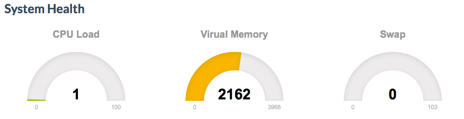

Livestats
=========

Features
--------

  - Expose information about the CPU and memory usage for the current host
  - It requires a websocket connection to work

Configuration
-------------

You need to enable the plugin by adding this line into the IoC configuration file.

.. code-block:: yaml

    element.plugins.livestats:
        websocket:
            access:  ws://element.vagrant:5000/websocket/system
            handler: /websocket/system

Also, you need to expose the livestats template with a simple ``node.template`` node

.. code-block:: yaml

    # labs/livestats.yaml
    title: System States
    type: node.template
    template: element.plugins.livestats:system.html

Preview
-------

   The gauge values
