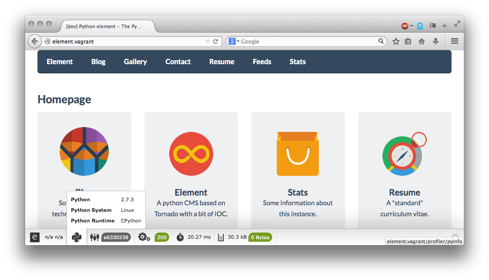
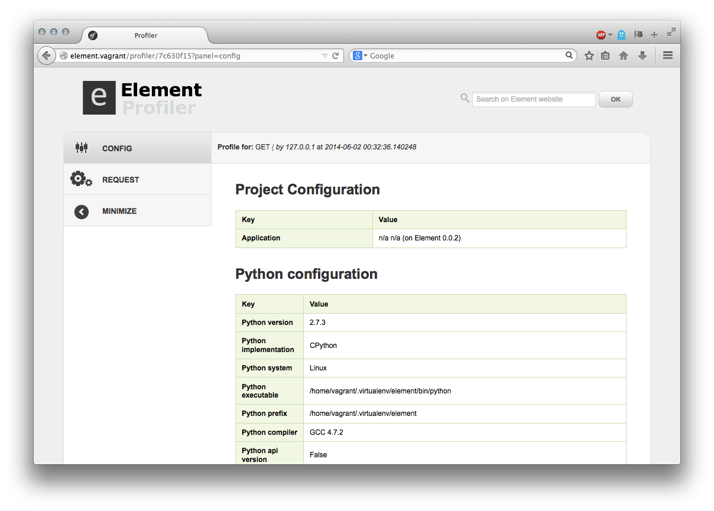

Profiler
========

Features
--------

  - Expose information about the current request
  - Memory Usage / Profiling ...

Configuration
-------------

There is no configuration option. You only need to enable the plugin by adding this line into the IoC configuration file.

.. code-block:: yaml

    element.plugins.profiler:

Usage
-----

The feature is enabled on dev mode, it does not work for threaded environment.

Preview
-------

   The wdt displays memory usage, processing time, controller and python version

   Display more detailed information profiling panel: config, request, etc ..

Credits
-------

The WDT is a python port of the `Symfony2 Profiler <http://symfony.com>`_.
Icons created by `Sensio <http://sensio.com>`_ are shared under a `Creative Commons Attribution license <http://creativecommons.org/licenses/by-sa/3.0/>`_.
